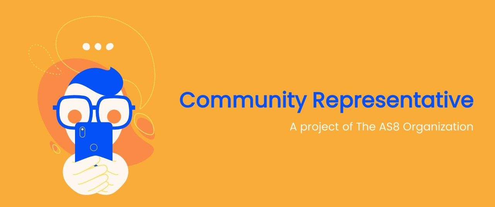

 

# CommunityRepresentative 🟠🔵 
Community Representatives play a vital role in the overall growth of The AS8 Organization. In this team, a bunch young enthusiasts took part in various activities from completing daily tasks to launching megaprojects.

We are developing a landing page website for the "COMMUNITY REPRESENTATIVE" project. This repository will host the source code.

 

# How to contribute
- Fork the repository
- Web Design can be found on [Figma](https://www.figma.com/file/bJBKBuPblKJfDQgI0ttLYe/Community-Representative?node-id=26%3A2228)
- All images can be found on [images](images)
- Code in the basic [html](index.html) file and add some styling with the basic [css](style.css) file
- Create a pull request
- Submit bugs and feature requests in [issues](https://github.com/The-AS8-organization/CommunityRepresentative/issues)

 

# License
Details can be found on [LICENSE](LICENSE)